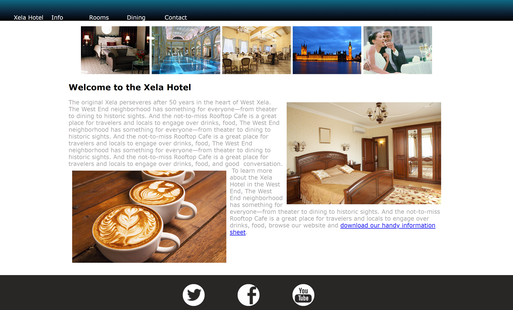
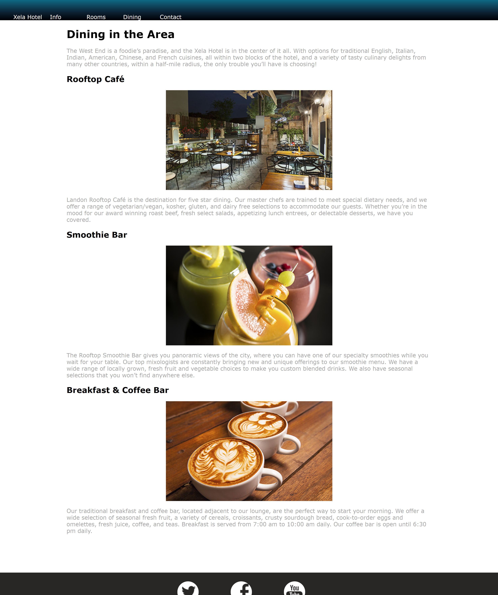
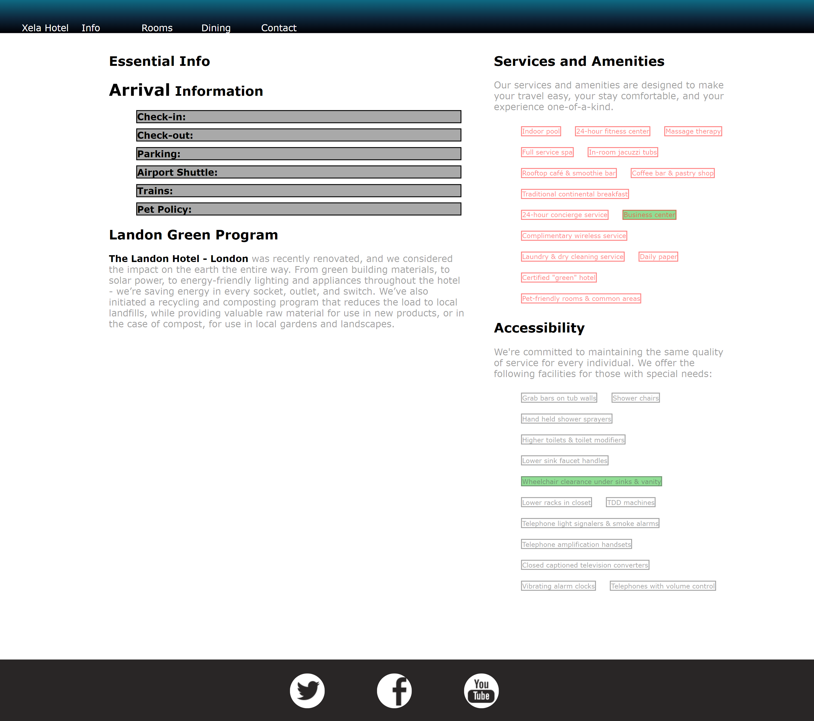
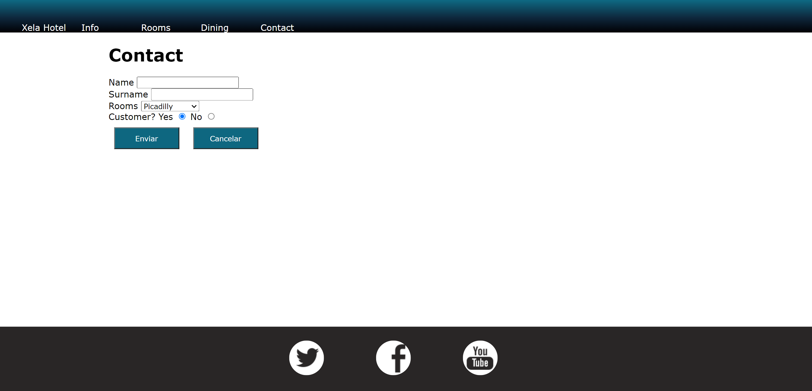

## Result Page:
### Home page:

### Dinning page:

### Info page:

### Rooms Page: 

### Contact page: 

---

## Link github-pages:

---

## Dificultad que tuve:

* Colocar un icono en la viñeta de forma individual.
* Sobre como colocar el fooder siempre en la pie de pagina.